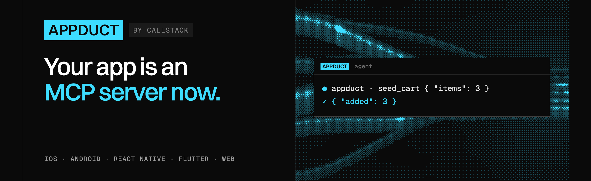

<a href="https://callstackincubator.github.io/appduct/"></a>

[![MIT license][license-badge]][license] [![npm downloads][npm-downloads-badge]][npm-downloads] [![PRs Welcome][prs-welcome-badge]][prs-welcome]

Appduct lets a terminal, a test runner, or an AI agent call functions inside your running iOS, Android, Flutter, React Native or web app. Appduct calls these functions tools. Only the tools you register are reachable.

## Why you'd want this

- **E2E tests skip the setup.** Instead of tapping through login, onboarding and an empty cart, a test calls `log_in` or `seed_cart` and starts at the screen it's testing.
- **Agents can drive your app.** Over MCP or the CLI, an agent can flip a feature flag, open a screen, or read some state through your tools.
- **No hidden debug UI.** There's no secret gesture or admin panel for someone to find.
- **Release builds leave it out.** By default Appduct is only in debug builds (debug and profile in Flutter). You can opt in for internal builds such as TestFlight; see [Build variants](https://callstackincubator.github.io/appduct/guides/build-variants/).

## How it works

1. You add the Appduct library to your app and register tools. Each tool has a name, a description, an input schema and a handler.
2. You install the `appduct` CLI on your computer. To connect, the CLI gives your app a link, either opened on the device for you or scanned as a QR code. The app then connects back to your computer over an encrypted connection. The connection survives reloads, backgrounding and dropped Wi-Fi.
3. You call tools from the terminal, a test, or an agent.

Register a tool in your app:

<details open>
<summary>iOS (Swift)</summary>

```swift
import AppductCore

try Appduct.shared.register(
  name: "seed_cart",
  description: "Fill the cart with test items.",
  inputSchema: ["type": "object", "properties": ["items": ["type": "number"]], "required": ["items"]]
) { args in
  ["added": (args["items"] as? NSNumber)?.intValue ?? 0]
}
```

</details>

<details>
<summary>Android (Kotlin)</summary>

```kotlin
import com.callstack.appduct.Appduct
import org.json.JSONObject

Appduct.register(
  name = "seed_cart",
  description = "Fill the cart with test items.",
  inputSchema = JSONObject("""{"type":"object","properties":{"items":{"type":"number"}},"required":["items"]}"""),
) { args ->
  JSONObject().put("added", args.optInt("items"))
}
```

</details>

<details>
<summary>Flutter (Dart)</summary>

```dart
import 'package:appduct/appduct.dart';

Appduct.instance.registerTool(
  'seed_cart',
  description: 'Fill the cart with test items.',
  inputSchema: {
    'type': 'object',
    'properties': {'items': {'type': 'number'}},
    'required': ['items'],
  },
  handler: (args, context) => {'added': (args['items'] as num).toInt()},
);
```

</details>

<details>
<summary>React Native</summary>

```ts
import { useAppductTool } from "@appduct/react-native";
import { z } from "zod";

useAppductTool({
  name: "seed_cart",
  description: "Fill the cart with test items.",
  inputSchema: z.object({ items: z.number() }),
  handler: async ({ items }) => ({ added: items }),
});
```

</details>

Call it from your terminal:

```bash
appduct tools call seed_cart --input '{"items":3}'
```

## Get started

1. Install the CLI:

   ```bash
   npm install -g appduct
   ```

2. Add Appduct to your app:
   - [iOS](packages/native/ios/README.md), with Swift Package Manager or CocoaPods
   - [Android](packages/native/android/README.md), from Maven Central
   - [React Native](packages/react-native/README.md). You need a development build; Expo Go doesn't work.
   - [Flutter](packages/flutter/README.md), from pub.dev
   - [Web](packages/web/README.md), for any framework or plain JavaScript

To try it before touching your own app, run a playground app: [iOS](playground-native/ios/README.md), [Android](playground-native/android/README.md) or [React Native](playground/README.md).

## Learn more

- [Documentation site](https://callstackincubator.github.io/appduct/): guides and reference for every platform
- [CLI guide](packages/appduct/README.md): connect to a device, list and call tools
- [Use Appduct with an agent](https://callstackincubator.github.io/appduct/guides/agents/): MCP config and the agent skill
- [Call tools from tests](packages/appduct/README.md#test-runners-appductclient): the `appduct/client` API
- [Registering tools](https://callstackincubator.github.io/appduct/guides/writing-tools/): schemas, long-running tools and events
- [Build variants](https://callstackincubator.github.io/appduct/guides/build-variants/): which builds include Appduct, including web production bundles
- [Security](https://callstackincubator.github.io/appduct/guides/security/): what it protects against, trust and key rotation
- [Packages and platform support](https://callstackincubator.github.io/appduct/start/introduction/#packages)

## Made with ❤️ at Callstack

`appduct` is an open source project and will always remain free to use. If you think it's cool, please star it 🌟. [Callstack][callstack-readme-with-love] is a group of React and React Native geeks, contact us at [hello@callstack.com](mailto:hello@callstack.com) if you need any help with these or just want to say hi!

Like the project? ⚛️ [Join the team](https://callstack.com/careers/?utm_campaign=Senior_RN&utm_source=github&utm_medium=readme) who does amazing stuff for clients and drives React Native Open Source! 🔥

[repo]: https://github.com/callstackincubator/appduct
[callstack-readme-with-love]: https://callstack.com/?utm_source=github.com&utm_medium=referral&utm_campaign=appduct&utm_term=readme-with-love
[license-badge]: https://img.shields.io/npm/l/appduct?style=for-the-badge
[license]: https://github.com/callstackincubator/appduct/blob/main/LICENSE
[npm-downloads-badge]: https://img.shields.io/npm/dm/appduct?style=for-the-badge
[npm-downloads]: https://www.npmjs.com/package/appduct
[prs-welcome-badge]: https://img.shields.io/badge/PRs-welcome-brightgreen.svg?style=for-the-badge
[prs-welcome]: https://github.com/callstackincubator/appduct/pulls
[chat-badge]: https://img.shields.io/discord/426714625279524876.svg?style=for-the-badge
[chat]: https://discord.gg/xgGt7KAjxv
